---
## Front matter
lang: ru-RU
title: Лабораторная работа № 2
subtitle: Простейший шаблон
author:
  - Cадова Д. А.
institute:
  - Российский университет дружбы народов, Москва, Россия

## i18n babel
babel-lang: russian
babel-otherlangs: english
## Fonts
mainfont: PT Serif
romanfont: PT Serif
sansfont: PT Sans
monofont: PT Mono
mainfontoptions: Ligatures=TeX
romanfontoptions: Ligatures=TeX
sansfontoptions: Ligatures=TeX,Scale=MatchLowercase
monofontoptions: Scale=MatchLowercase,Scale=0.9

## Formatting pdf
toc: false
toc-title: Содержание
slide_level: 2
aspectratio: 169
section-titles: true
theme: metropolis
header-includes:
 - \metroset{progressbar=frametitle,sectionpage=progressbar,numbering=fraction}
 - '\makeatletter'
 - '\beamer@ignorenonframefalse'
 - '\makeatother'
---

# Информация

## Докладчик

:::::::::::::: {.columns align=center}
::: {.column width="70%"}

  * Садова Диана Алексеевна
  * студент бакалавриата
  * Российский университет дружбы народов
  * [113229118@pfur.ru]
  * <https://DianaSadova.github.io/ru/>

:::
::::::::::::::

# Вводная часть

## Актуальность

- Разобратся в работе с учётными записями пользователей и группами пользователей 

## Цели и задачи

- Получить представление о работе с учётными записями пользователей и группами пользователей в операционной системе типа Linux.

## Материалы и методы

- Текст лабороторной работы № 2
- Опыт прошлого года 

## Содержание исследования

- Определите, какую учётную запись пользователя вы используете, введя команду.

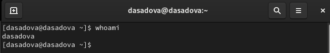

## 
- Выведите на экран более подробную информацию, используя команду.

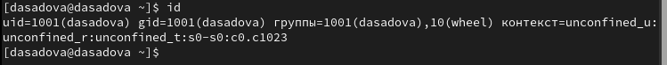

uid - реальный идентификатор пользователя. gid - идентификатор основной группы пользователя. groups - идентификаторы дополнительных групп. Далее идет unconfined_u, unconfined_r и unconfined_t - контекст безопасности процесса, который обычно является контекстом безопасности пользователя

##

- Используйте команду su для переключения к учётной записи root. При запросе пароля введите пароль пользователя root.

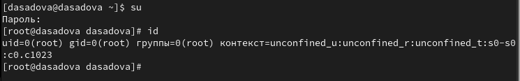

root - это суперпользователь и у него нет огроничений связанных с идентификаторами. Информация о безорасности не изменилась

##

- Просмотрите в безопасном режиме файл /etc/sudoers, используя, например, sudo -i visudo

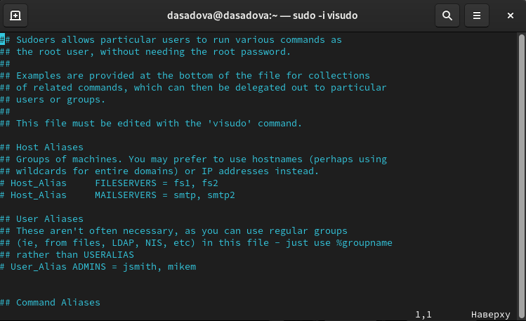

##

Неправильный синтаксис файла /etc/sudoers может нарушить работу системы и сделать невозможным получение повышенного уровня привилегий, и поэтому очень важно использовать для его редактирования команду visudo. Главная особеность в том, что visudo проверяет синтаксис файла при его сохранении

##

- Убедитесь, что в открытом с помощью visudo файле присутствует строка %wheel ALL=(ALL) ALL.

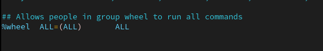

wheel - команда для возможности давать или отнимать права на использование команды sudo.

##

- Убедитесь, что пользователь alice добавлен в группу wheel, введя id alice.

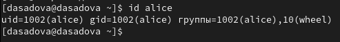

##

- Создайте пользователя bob:

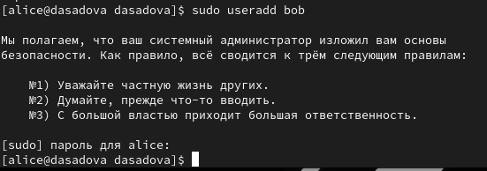

##

- Просмотрите, в какие группы входит пользователь bob:

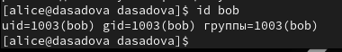

##

- Откройте файл конфигурации /etc/login.defs для редактирования, используя, например, vim (не забудьте, что требуются полномочия пользователя root):

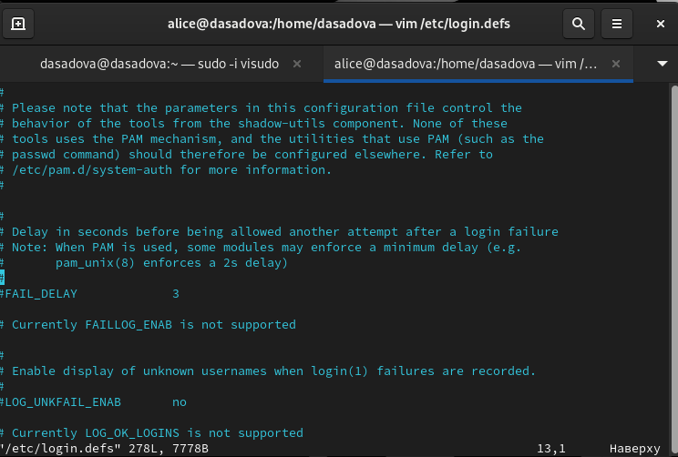

##

- Перейдите в каталог /etc/skel:

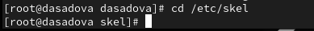

##

- Создайте каталоги Pictures и Documents: 

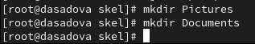

##

- Измените содержимое файла .bashrc, добавив строку export EDITOR=/usr/bin/vim или export EDITOR=/usr/bin/mceditor 

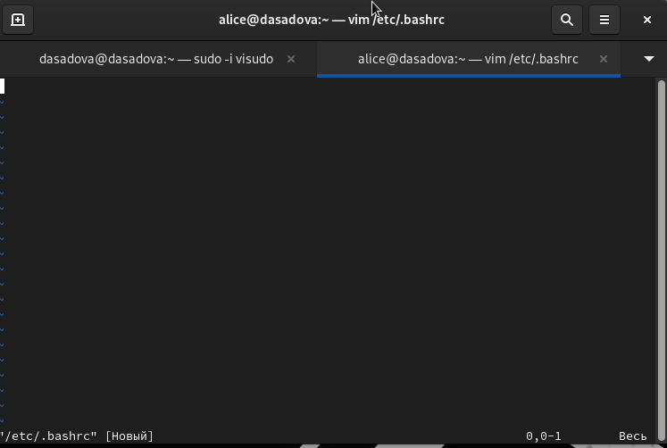

##

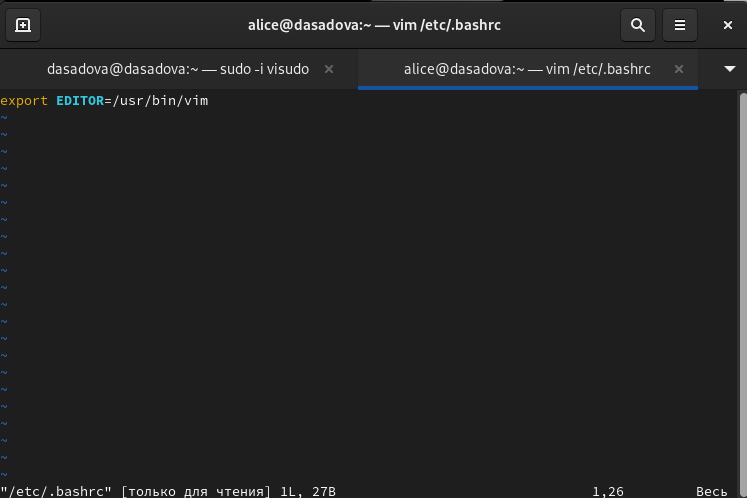

##

- Переключитесь в терминале на учётную запись пользователя alice:

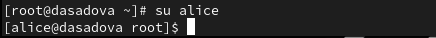

##

- Посмотрите и прокомментируйте информацию о пользователе carol, проверьте, в какую первоначальную группу входит пользователь carol; также убедитесь, что каталоги Pictures и Documents были созданы в домашнем каталоге пользователя carol:

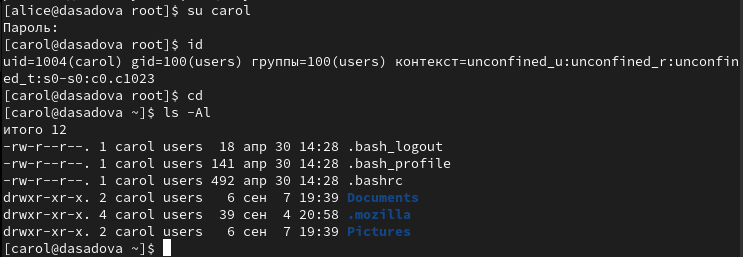

carol входит в группу users. Данный пользователь может читать и редактировать свои файлы (файлы пользователя) и толко читать файлы группы и всех остальных. Имеет доступ к каталогам Pictures и Documents

##

- Поясните в отчёте строку записи о пароле пользователя carol в файле /etc/shadow:

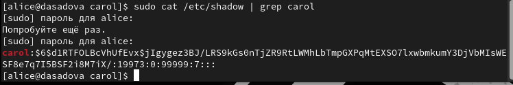

##

1) Имя пользователя 

2) Зашиврованый пароль пользователя

3) Количество дней, с 1 января 1970 года, когда пароль был изменён в последний раз. В нашем случае это 19973 дней.

4) Количество дней до того, как пароль может быть изменён. У нас это 0. Можно сказать что мы можем менять пароль данного пользователя постоянно. Но настаящая цель пункта - это ужестожение политики системного администратора.

5) Количество дней, после которых необходимо изменить пароль. Наше значение равно 99999. Это около 273 лет.

6) За сколько дней до истечения срока действия пароля пользователь получает предупреждение. У нас предупреждение поступит за 7 дней.

##

7) Через сколько дней после истечения срока действия пароля учётная запись будет отключена

8) Количество дней, с 1 января 1970 года, когда эта учётная запись была отключена

9) Зарезервированное поле, которое добавлено для будущего использования.

## Работа с группами

-  Находясь под учётной записью пользователя alice, создайте группы main и third:

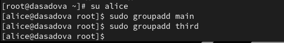

##

- Используйте usermod для добавления пользователей alice и bob в группу main,
а carol, dan, dave и david — в группу third:
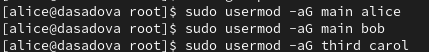

##

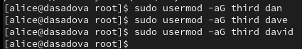

##

- Определите, участниками каких групп являются другие созданные вами пользователи.
Укажите эту информацию в отчётe.

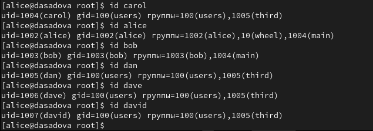

## Результаты

- Получили представление о работе с учётными записями пользователей и группами пользователей в операционной системе типа Linux.

