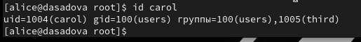
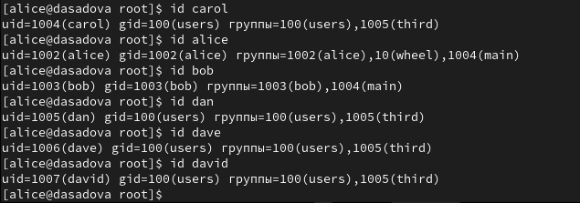

---
## Front matter
title: "Лабораторная работа № 2."
subtitle: "Управление пользователями и группами"
author: "Диана Алексеевна Садова"

## Generic otions
lang: ru-RU
toc-title: "Содержание"

## Bibliography
bibliography: bib/cite.bib
csl: pandoc/csl/gost-r-7-0-5-2008-numeric.csl

## Pdf output format
toc: true # Table of contents
toc-depth: 2
lof: true # List of figures
lot: true # List of tables
fontsize: 12pt
linestretch: 1.5
papersize: a4
documentclass: scrreprt
## I18n polyglossia
polyglossia-lang:
  name: russian
  options:
	- spelling=modern
	- babelshorthands=true
polyglossia-otherlangs:
  name: english
## I18n babel
babel-lang: russian
babel-otherlangs: english
## Fonts
mainfont: PT Serif
romanfont: PT Serif
sansfont: PT Sans
monofont: PT Mono
mainfontoptions: Ligatures=TeX
romanfontoptions: Ligatures=TeX
sansfontoptions: Ligatures=TeX,Scale=MatchLowercase
monofontoptions: Scale=MatchLowercase,Scale=0.9
## Biblatex
biblatex: true
biblio-style: "gost-numeric"
biblatexoptions:
  - parentracker=true
  - backend=biber
  - hyperref=auto
  - language=auto
  - autolang=other*
  - citestyle=gost-numeric
## Pandoc-crossref LaTeX customization
figureTitle: "Рис."
tableTitle: "Таблица"
listingTitle: "Листинг"
lofTitle: "Список иллюстраций"
lotTitle: "Список таблиц"
lolTitle: "Листинги"
## Misc options
indent: true
header-includes:
  - \usepackage{indentfirst}
  - \usepackage{float} # keep figures where there are in the text
  - \floatplacement{figure}{H} # keep figures where there are in the text
---

# Цель работы

Получить представление о работе с учётными записями пользователей и группами пользователей в операционной системе типа Linux.

# Последовательность выполнения работы

## Переключение учётных записей пользователей
1. Войдите в систему как обычный пользователь и откройте терминал.(рис. [-@fig:001]).

{#fig:001 width=90%}

2. Определите, какую учётную запись пользователя вы используете, введя команду.(рис. [-@fig:002]).

{#fig:002 width=90%}

Выведите на экран более подробную информацию, используя команду(рис. [-@fig:003]).

{#fig:003 width=90%}

В отчёте дайте пояснение по отображённой информации.

uid - реальный идентификатор пользователя. gid - идентификатор основной группы пользователя. groups - идентификаторы дополнительных групп. Далее идет unconfined_u, unconfined_r и unconfined_t - контекст безопасности процесса, который обычно является контекстом безопасности пользователя

3. Используйте команду su для переключения к учётной записи root. При запросе пароля введите пароль пользователя root. (рис. [-@fig:004]).

{#fig:004 width=90%}

В отчёте дайте пояснение по отображённой информации.

root - это суперпользователь и у него нет огроничений связанных с идентификаторами. Информация о безорасности не изменилась 

4. Вернитесь к учётной записи своего пользователя:
su имя_пользователя
или воспользуйтесь комбинацией клавиш Ctrl + d или командой exit.(рис. [-@fig:005]).

{#fig:005 width=90%}

5. Просмотрите в безопасном режиме файл /etc/sudoers, используя, например, sudo -i visudo (рис. [-@fig:006])

Обычно visudo открывает файл /etc/sudoers в текстовом редакторе vi, но проверяет синтаксис файла при его сохранении. Открываемый visudo редактор можно указать любой. Например, если требуется использовать mcedit, то в терминале для запуска visudo следует указать: sudo -i EDITOR=mcedit visudo

{#fig:006 width=90%}

В отчёте поясните, почему для работы с файлом /etc/sudoers требуется использовать visudo, а не произвольный редактор.

Неправильный синтаксис файла /etc/sudoers может нарушить работу системы и сделать невозможным получение повышенного уровня привилегий, и поэтому очень важно использовать для его редактирования команду visudo. Главная особеность в том, что visudo проверяет синтаксис файла при его сохранении

6. Убедитесь, что в открытом с помощью visudo файле присутствует строка %wheel ALL=(ALL) ALL (рис. [-@fig:007]).

{#fig:007 width=90%}

В отчёте поясните, что это означает и для чего нужна группа wheel.

wheel - команда для возможности давать или отнимать права на использование команды sudo. 

7. Создайте пользователя alice, входящего в группу wheel:(рис. [-@fig:008]).

{#fig:008 width=90%}

8. Убедитесь, что пользователь alice добавлен в группу wheel, введя id alice(рис. [-@fig:009]).

{#fig:009 width=90%}

9. Задайте пароль для пользователя alice, набрав sudo -i passwd alice (рис. [-@fig:010]). Пароль требуется ввести дважды.

{#fig:010 width=90%}

10. Переключитесь на учётную запись пользователя alice:(рис. [-@fig:011]).

{#fig:011 width=90%}

11. Создайте пользователя bob:(рис. [-@fig:012]).

{#fig:012 width=90%}

Введите пароль при запросе. Проверьте, что пользователь bob создан.(рис. [-@fig:013]).

{#fig:013 width=90%}

12. Установите пароль для пользователя bob:(рис. [-@fig:014]).

{#fig:014 width=90%}

13. Просмотрите, в какие группы входит пользователь bob:(рис. [-@fig:015]).

{#fig:015 width=90%}

## Создание учётных записей пользователей

Применим общие решения для создания учётных записей пользователей.

1. Переключитесь в терминале на учётную запись пользователя root:(рис. [-@fig:016]).

{#fig:016 width=90%}

2. Откройте файл конфигурации /etc/login.defs для редактирования, используя, например, vim (не забудьте, что требуются полномочия пользователя root):(рис. [-@fig:017]).

{#fig:017 width=90%}

Измените несколько параметров. Например, найдите параметр CREATE_HOME и убедитесь, что он установлен в значение yes. Также установите параметр USERGROUPS_ENAB no (рис. [-@fig:018]).

{#fig:018 width=90%}

Это позволит не добавлять нового пользователя в группу с тем же именем, что и пользователь, а использовать группу users.

3. Перейдите в каталог /etc/skel:(рис. [-@fig:019]).

{#fig:019 width=90%}

Создайте каталоги Pictures и Documents: (рис. [-@fig:020]).

{#fig:020 width=90%}

Это позволит добавить эти каталоги по умолчанию во все домашние каталоги пользователей.

4. Измените содержимое файла .bashrc, добавив строку export EDITOR=/usr/bin/vim или export EDITOR=/usr/bin/mceditor (рис. [-@fig:021]), (рис. [-@fig:022]).

{#fig:021 width=90%}

{#fig:022 width=90%}

На первой фотографии показано, что наш файл пуст. Далее вводиься команда export EDITOR=/usr/bin/vim

Эта запись означает, что текстовый редактор vim или редактор mceditor будет установлен по умолчанию для инструментов, которые нуждаются в изменении текстовых файлов.

5. Переключитесь в терминале на учётную запись пользователя alice:(рис. [-@fig:023]).

{#fig:023 width=90%}

6. Используя утилиту useradd, создайте пользователя carol:(рис. [-@fig:024]).

{#fig:024 width=90%}

7. Установите пароль для пользователя carol:(рис. [-@fig:025]).

{#fig:025 width=90%}

8. Посмотрите и прокомментируйте информацию о пользователе carol, проверьте, в какую первоначальную группу входит пользователь carol; также убедитесь, что каталоги Pictures и Documents были созданы в домашнем каталоге пользователя carol:(рис. [-@fig:026]).

{#fig:026 width=90%}

carol входит в группу users. Данный пользователь может читать и редактировать свои файлы (файлы пользователя) и толко читать файлы группы и всех остальных. Имеет доступ к каталогам Pictures и Documents

9. Переключитесь в терминале на учётную запись пользователя alice:(рис. [-@fig:027]).

{#fig:027 width=90%}

10. Поясните в отчёте строку записи о пароле пользователя carol в файле /etc/shadow:(рис. [-@fig:028]).

{#fig:028 width=90%}

1) Имя пользователя 

2) Зашиврованый пароль пользователя

3) Количество дней, с 1 января 1970 года, когда пароль был изменён в последний раз. В нашем случае это 19973 дней.

4) Количество дней до того, как пароль может быть изменён. У нас это 0. Можно сказать что мы можем менять пароль данного пользователя постоянно. Но настаящая цель пункта - это ужестожение политики системного администратора.

5) Количество дней, после которых необходимо изменить пароль. Наше значение равно 99999. Это около 273 лет.

6) За сколько дней до истечения срока действия пароля пользователь получает предупреждение. У нас предупреждение поступит за 7 дней.

7) Через сколько дней после истечения срока действия пароля учётная запись будет отключена

8) Количество дней, с 1 января 1970 года, когда эта учётная запись была отключена

9) Зарезервированное поле, которое добавлено для будущего использования.

11. Измените свойства пароля пользователя carol следующим образом:(рис. [-@fig:029]).

{#fig:029 width=90%}

В этой записи срок действия пароля истекает через 90 дней (-x 90). За три дня до истечения срока действия пользователь получит предупреждение (-w 3). Пароль должен использоваться как минимум за 30 дней (-n 30) до того, как его можно будет изменить.

12. Убедитесь в изменении в строке с данными о пароле пользователя carol в файле /etc/shadow:(рис. [-@fig:030]).

{#fig:030 width=90%}

13. Убедитесь, что идентификатор alice существует во всех трёх файлах:(рис. [-@fig:031]).

{#fig:031 width=90%}

14. Убедитесь, что идентификатор carol существует не во всех трёх файлах:(рис. [-@fig:032]).

{#fig:032 width=90%}

## Работа с группами

В этом упражнении требуется создать две группы и добавить некоторых пользователей в эти группы.

1. Находясь под учётной записью пользователя alice, создайте группы main и third:(рис. [-@fig:033]).

{#fig:033 width=90%}

2. Используйте usermod для добавления пользователей alice и bob в группу main,
а carol, dan, dave и david — в группу third:(рис. [-@fig:034]),(рис. [-@fig:035]).

{#fig:034 width=90%}

{#fig:035 width=90%}

3. Убедитесь, что пользователь carol правильно добавлен в группу third:(рис. [-@fig:036]).

Пользователю carol должна быть назначена основная группа с идентификатором gid = 100 (users). Определите, в какие вторичные группы входит carol.

{#fig:036 width=90%}

carol также входит в группу third

4. Определите, участниками каких групп являются другие созданные вами пользователи.
Укажите эту информацию в отчётe. (рис. [-@fig:037]).

{#fig:037 width=90%}

Пользователи alice находится в группах wheel и main.

Пользователи bob находится в группе main.

Пользователи carol, dan, dave и david добавленны в группу third и users.

# Выводы

Получили представление о работе с учётными записями пользователей и группами пользователей в операционной системе типа Linux.

# Список литературы{.unnumbered}

::: {#refs}
:::
