---
## Front matter
lang: ru-RU
title: Лабораторная работа № 3
subtitle: Простейший шаблон
author:
  - Cадова Д. А.
institute:
  - Российский университет дружбы народов, Москва, Россия

## i18n babel
babel-lang: russian
babel-otherlangs: english
## Fonts
mainfont: PT Serif
romanfont: PT Serif
sansfont: PT Sans
monofont: PT Mono
mainfontoptions: Ligatures=TeX
romanfontoptions: Ligatures=TeX
sansfontoptions: Ligatures=TeX,Scale=MatchLowercase
monofontoptions: Scale=MatchLowercase,Scale=0.9

## Formatting pdf
toc: false
toc-title: Содержание
slide_level: 2
aspectratio: 169
section-titles: true
theme: metropolis
header-includes:
 - \metroset{progressbar=frametitle,sectionpage=progressbar,numbering=fraction}
 - '\makeatletter'
 - '\beamer@ignorenonframefalse'
 - '\makeatother'
---

# Информация

## Докладчик

:::::::::::::: {.columns align=center}
::: {.column width="70%"}

  * Садова Диана Алексеевна
  * студент бакалавриата
  * Российский университет дружбы народов
  * [113229118@pfur.ru]
  * <https://DianaSadova.github.io/ru/>

:::
::::::::::::::

# Вводная часть

## Актуальность

- Получение базовых и специальных прав доступа для групп

## Цели и задачи

- Получение навыков настройки базовых и специальных прав доступа для групп пользователей в операционной системе типа Linux.

## Материалы и методы

- Текст лабороторной работы № 3
- Опыт прошлого года 

## Содержание исследования

- Откройте терминал с учётной записью root:

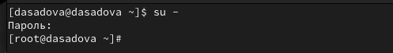

##

- В корневом каталоге создайте каталоги /data/main и /data/third:

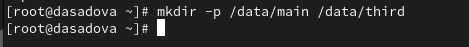

##

- Установите разрешения, позволяющие владельцам каталогов записывать файлы в эти каталоги и запрещающие доступ к содержимому каталогов всем другим пользователям и группам. Проверьте установленные права доступа.

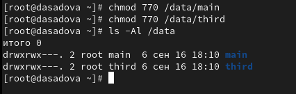

##

- Под пользователем bob попробуйте перейти в каталог /data/main и создать файл emptyfile в этом каталоге:

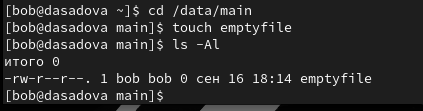

##

- Под пользователем bob попробуйте перейти в каталог /data/third и создать файл emptyfile в этом каталоге.

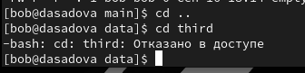

##

- Создайте два файла, владельцем которых является alice:

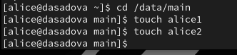

##

- Перейдите в каталог /data/main:

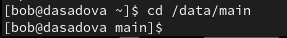

##

- и в этом каталоге введите:

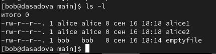

##

- Вы увидите два файла, созданные пользователем alice. Попробуйте удалить файлы, принадлежащие пользователю alice:

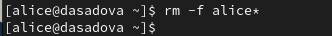

##

- Убедитесь, что файлы будут удалены пользователем bob.

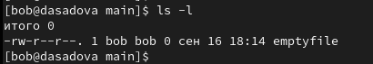

##

- В терминале под пользователем root установите для каталога /data/main бит идентификатора группы, а также stiky-бит для разделяемого (общего) каталога группы:

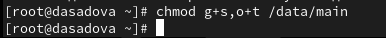

##

- В терминале под пользователем alice создайте в каталоге /data/main файлы alice3 и alice4. Теперь вы должны увидеть, что два созданных вами файла принадлежат группе main, которая является группой-владельцем каталога /data/main.

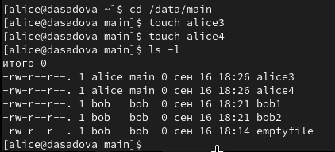

##

- В терминале под пользователем alice попробуйте удалить файлы, принадлежащие пользователю bob:

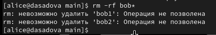

##

- Установите права на чтение и выполнение в каталоге /data/main для группы third и права на чтение и выполнение для группы main в каталоге /data/third:

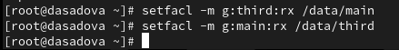{#fig:023 width=90%}

##

- Используйте команду getfacl, чтобы убедиться в правильности установки разрешений:

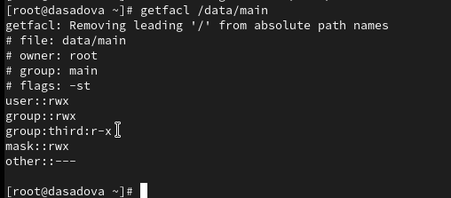

##

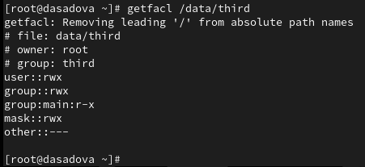

##

- Создайте новый файл с именем newfile1 в каталоге /data/main:

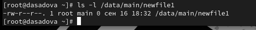

- Права доступа у файла "-rw-r--r--" - это значит что владелец файла имеет права только на чтение и запись (rw), а группа и остальные пользователи — только на чтение (r)

##

- Выполните аналогичные действия для каталога /data/third.

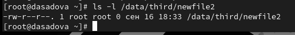

##

- Установите ACL по умолчанию для каталога /data/main:

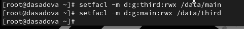

##

- Добавьте ACL по умолчанию для каталога /data/third:

##

- Для проверки полномочий группы third в каталоге /data/third войдите в другом терминале под учётной записью члена группы third:

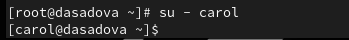

##

- Проверьте операции с файлами:

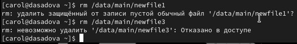

##

- Проверьте, возможно ли осуществить запись в файл:

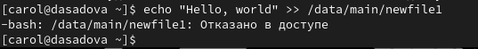

##

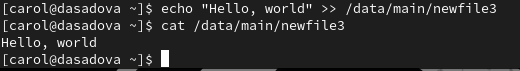

##

В первом случае у нас отказ в доступе - это связанно с правами доступа файла newfile1. Пользователь carol, который записанн в каталоге third не имеет прав доступа редактировать файла newfile1 не своего каталога (каталога main).

Во втором случае получилось записать в файл newfile3, так как его прова доступа разрешают редактировать его другим пользователям (остальные пользователи)

## Результаты

- Смогли получить базовые и специальные прав доступа для групп в операционной системе типа Linux.
