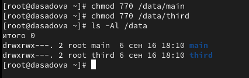

---
## Front matter
title: "Лабораторная работа № 3."
subtitle: "Настройка прав доступа"
author: "Диана Алексеевна Садова"

## Generic otions
lang: ru-RU
toc-title: "Содержание"

## Bibliography
bibliography: bib/cite.bib
csl: pandoc/csl/gost-r-7-0-5-2008-numeric.csl

## Pdf output format
toc: true # Table of contents
toc-depth: 2
lof: true # List of figures
lot: true # List of tables
fontsize: 12pt
linestretch: 1.5
papersize: a4
documentclass: scrreprt
## I18n polyglossia
polyglossia-lang:
  name: russian
  options:
	- spelling=modern
	- babelshorthands=true
polyglossia-otherlangs:
  name: english
## I18n babel
babel-lang: russian
babel-otherlangs: english
## Fonts
mainfont: PT Serif
romanfont: PT Serif
sansfont: PT Sans
monofont: PT Mono
mainfontoptions: Ligatures=TeX
romanfontoptions: Ligatures=TeX
sansfontoptions: Ligatures=TeX,Scale=MatchLowercase
monofontoptions: Scale=MatchLowercase,Scale=0.9
## Biblatex
biblatex: true
biblio-style: "gost-numeric"
biblatexoptions:
  - parentracker=true
  - backend=biber
  - hyperref=auto
  - language=auto
  - autolang=other*
  - citestyle=gost-numeric
## Pandoc-crossref LaTeX customization
figureTitle: "Рис."
tableTitle: "Таблица"
listingTitle: "Листинг"
lofTitle: "Список иллюстраций"
lotTitle: "Список таблиц"
lolTitle: "Листинги"
## Misc options
indent: true
header-includes:
  - \usepackage{indentfirst}
  - \usepackage{float} # keep figures where there are in the text
  - \floatplacement{figure}{H} # keep figures where there are in the text
---

# Цель работы

Получение навыков настройки базовых и специальных прав доступа для групп пользователей в операционной системе типа Linux.

# Последовательность выполнения работы

Предпосылки: в лабораторной работе № 2 были созданы пользователи alice и bob, входящие в группу main, и пользователь carol, входящий в группу third.

## Управление базовыми разрешениями

Требуется создать структуру каталогов с разными разрешениями доступа для разных групп пользователей.

1. Откройте терминал с учётной записью root:(рис. [-@fig:001]).

{#fig:001 width=90%}

2. В корневом каталоге создайте каталоги /data/main и /data/third:(рис. [-@fig:002]).

{#fig:002 width=90%}

Посмотрите, кто является владельцем этих каталогов. Для этого используйте:(рис. [-@fig:003]).

{#fig:003 width=90%}

3. Прежде чем устанавливать разрешения, измените владельцев этих каталогов с root на main и third соответственно:(рис. [-@fig:004]).

{#fig:004 width=90%}

Посмотрите, кто теперь является владельцем этих каталогов:(рис. [-@fig:005]).

{#fig:005 width=90%}

4. Установите разрешения, позволяющие владельцам каталогов записывать файлы в эти каталоги и запрещающие доступ к содержимому каталогов всем другим пользователям и группам. Проверьте установленные права доступа(рис. [-@fig:006]).

{#fig:006 width=90%}

5. В другом терминале перейдите под учётную запись пользователя bob:(рис. [-@fig:007]).

{#fig:007 width=90%}

6. Под пользователем bob попробуйте перейти в каталог /data/main и создать файл emptyfile в этом каталоге:(рис. [-@fig:008]).

{#fig:008 width=90%}

Опишите и поясните результат этого действия.

Пользователь bob может создать файл в каталоге main, так как имет права достура в каталоге 

7. Под пользователем bob попробуйте перейти в каталог /data/third и создать файл emptyfile в этом каталоге.(рис. [-@fig:009]).

{#fig:009 width=90%}

Опишите и поясните результат этого действия.

Пользователь bob не может создать файл в каталоге third, так как сам не пренадлежит к этому каталогу и не имеет прав доступа 

## Управление специальными разрешениями

Требуется, используя специальные разрешения для групп пользователей, обеспечить обмен файлами в общем для групп каталоге. При этом каталогу назначается бит идентификатора группы, а также sticky bit.

Sticky bit — дополнительный атрибут файлов или каталогов в ОС типа Linux, применяющийся в основном для каталогов с целью защиты содержимого каталогов от повреждения или удаления пользователями, не являющимися их владельцами. Для установки этого атрибута используется утилита chmod. Восьмеричное значение stiky-бита: 1000, а символьное: +t.

1. Откройте новый терминал под пользователем alice.(рис. [-@fig:010]).

{#fig:010 width=90%}

2. Перейдите в каталог /data/main:(рис. [-@fig:011]).

{#fig:011 width=90%}

Создайте два файла, владельцем которых является alice:(рис. [-@fig:012]).

{#fig:012 width=90%}

3. В другом терминале перейдите под учётную запись пользователя bob (пользователь bob является членом группы main, как и alice):(рис. [-@fig:013]).

{#fig:013 width=90%}

4. Перейдите в каталог /data/main:(рис. [-@fig:014]).

{#fig:014 width=90%}

и в этом каталоге введите:(рис. [-@fig:015]).

{#fig:015 width=90%}

Вы увидите два файла, созданные пользователем alice. Попробуйте удалить файлы, принадлежащие пользователю alice:(рис. [-@fig:016]).

{#fig:016 width=90%}

Убедитесь, что файлы будут удалены пользователем bob.(рис. [-@fig:017]).

{#fig:017 width=90%}

5. Создайте два файла, которые принадлежат пользователю bob:(рис. [-@fig:018]).

{#fig:018 width=90%}

6. В терминале под пользователем root установите для каталога /data/main бит идентификатора группы, а также stiky-бит для разделяемого (общего) каталога группы:(рис. [-@fig:019]).

{#fig:019 width=90%}

7. В терминале под пользователем alice создайте в каталоге /data/main файлы alice3 и alice4:(рис. [-@fig:020]).

Теперь вы должны увидеть, что два созданных вами файла принадлежат группе main, которая является группой-владельцем каталога /data/main.(рис. [-@fig:020]).

{#fig:020 width=90%}

8. В терминале под пользователем alice попробуйте удалить файлы, принадлежащие пользователю bob:(рис. [-@fig:021]).

{#fig:021 width=90%}

Убедитесь, что sticky-bit предотвратит удаление этих файлов пользователем alice, поскольку этот пользователь не является владельцем этих файлов. Обратите внимание: поскольку пользователь alice является владельцем каталога /data/main, то он может удалить все свои файлы в любом случае.

## Управление расширенными разрешениями с использованием списков ACL

В этом упражнении продолжим работать в созданных ранее каталогах /data/main и /data/third. В предыдущих упражнениях для группы main были установлены разрешения на каталог /data/main, а у группы third — на каталог /data/third.

Требуется установить для группы third разрешения на чтение в каталоге /data/main, а для группы main — разрешения на чтение в каталоге /data/third. Затем требуется установить права доступа по умолчанию, чтобы убедиться в правильности установки разрешений для новых элементов этих каталогов. Для этого будет использоваться пакет acl и команды setfacl (для установки прав) и getfacl (для просмотра установленных прав).

Кратко опишем синтаксис команды setfacl.

Установить разрешения для пользователя:

setfacl -m "u:user:permissions" <file/dir>

Установить разрешения для группы:

setfacl -m "g:group:permissions" <file/dir>

Наследование записи ACL родительского каталога:

setfacl -dm "entry" <dir>

Удаление записи ACL:

setfacl -x "entry" <file/dir>

Синтаксис команды getfacl:

getfacl <file/dir>

Применим команды setfacl и getfacl для выполнения поставленной задачи.

1. Откройте терминал с учётной записью root(рис. [-@fig:022]).

{#fig:022 width=90%}

2. Установите права на чтение и выполнение в каталоге /data/main для группы third и права на чтение и выполнение для группы main в каталоге /data/third:(рис. [-@fig:023]).

{#fig:023 width=90%}

3. Используйте команду getfacl, чтобы убедиться в правильности установки разрешений:(рис. [-@fig:024]),(рис. [-@fig:025]).

{#fig:024 width=90%}

{#fig:025 width=90%}

4. Создайте новый файл с именем newfile1 в каталоге /data/main:(рис. [-@fig:026]).

{#fig:026 width=90%}

Используйте getfacl /data/main/newfile1 для проверки текущих назначений полномочий. Какие права доступа у этого файла?

Объясните, почему.

Права доступа у файла "-rw-r--r--" - это значит что владелец файла имеет права только на чтение и запись (rw), а группа и остальные пользователи — только на чтение (r)

Выполните аналогичные действия для каталога /data/third. Дайте пояснения.(рис. [-@fig:027]).

{#fig:027 width=90%}

5. Установите ACL по умолчанию для каталога /data/main:(рис. [-@fig:028]).

{#fig:028 width=90%}

6. Добавьте ACL по умолчанию для каталога /data/third:(рис. [-@fig:029]).

{#fig:029 width=90%}

7. Убедитесь, что настройки ACL работают, добавив новый файл в каталог /data/main. Используйте getfacl /data/main/newfile2 для проверки текущих назначений полномочий.(рис. [-@fig:030]).

{#fig:030 width=90%}

Выполните аналогичные действия для каталога /data/third.(рис. [-@fig:031]).

{#fig:031 width=90%}

8. Для проверки полномочий группы third в каталоге /data/third войдите в другом терминале под учётной записью члена группы third:(рис. [-@fig:032]).

{#fig:032 width=90%}

Проверьте операции с файлами:(рис. [-@fig:033]).

{#fig:033 width=90%}

Проверьте, возможно ли осуществить запись в файл:(рис. [-@fig:034]),(рис. [-@fig:035]).

{#fig:034 width=90%}

{#fig:035 width=90%}

Объясните результат произведённых действий.

В первом случае у нас отказ в доступе - это связанно с правами доступа файла newfile1. Пользователь carol, который записанн в каталоге third не имеет прав доступа редактировать файла newfile1 не своего каталога (каталога main).

Во втором случае получилось записать в файл newfile3, так как его прова доступа разрешают редактировать его другим пользователям (остальные пользователи)

# Выводы

Получили навыки настройки базовых и специальных прав доступа для групп пользователей в операционной системе типа Linux. Больше узнали о правах доступа пользователей 
# Список литературы{.unnumbered}

::: {#refs}
:::
