---
## Front matter
lang: ru-RU
title: Лабораторная работа № 4
subtitle: Простейший шаблон
author:
  - Cадова Д. А.
institute:
  - Российский университет дружбы народов, Москва, Россия

## i18n babel
babel-lang: russian
babel-otherlangs: english
## Fonts
mainfont: PT Serif
romanfont: PT Serif
sansfont: PT Sans
monofont: PT Mono
mainfontoptions: Ligatures=TeX
romanfontoptions: Ligatures=TeX
sansfontoptions: Ligatures=TeX,Scale=MatchLowercase
monofontoptions: Scale=MatchLowercase,Scale=0.9

## Formatting pdf
toc: false
toc-title: Содержание
slide_level: 2
aspectratio: 169
section-titles: true
theme: metropolis
header-includes:
 - \metroset{progressbar=frametitle,sectionpage=progressbar,numbering=fraction}
 - '\makeatletter'
 - '\beamer@ignorenonframefalse'
 - '\makeatother'
---

# Информация

## Докладчик

:::::::::::::: {.columns align=center}
::: {.column width="70%"}

  * Садова Диана Алексеевна
  * студент бакалавриата
  * Российский университет дружбы народов
  * [113229118@pfur.ru]
  * <https://DianaSadova.github.io/ru/>

:::
::::::::::::::

# Вводная часть

## Актуальность

- Нам нужно получить проктические навыки работы с репозиториями и менеджерами пакетов.

## Цели и задачи

- Получить навыки работы с репозиториями и менеджерами пакетов.

## Материалы и методы

- Текст лабороторной работы № 4
- Опыт прошлого года 

## Содержание исследования

- Перейдите в каталог /etc/yum.repos.d и изучите содержание каталога и файлов репозиториев:

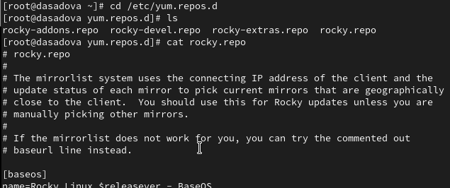

##

- Выведите на экран список репозиториев:

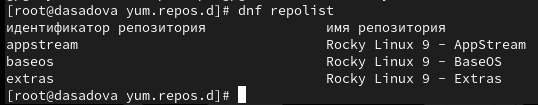

Данная команда отображает списк подключённых репозиториев

##

- Выведите на экран список пакетов, в названии или описании которых есть слово user:

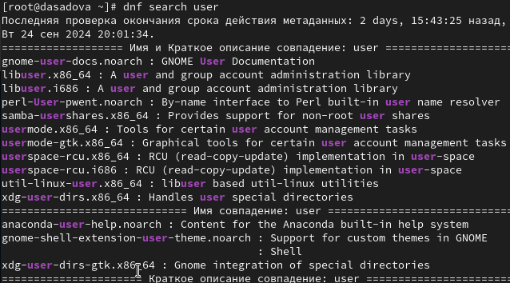

- Данная команда ищет все пакеты с именем в котором есть слово user

##

- Установите nmap, предварительно изучив информацию по имеющимся пакетам:

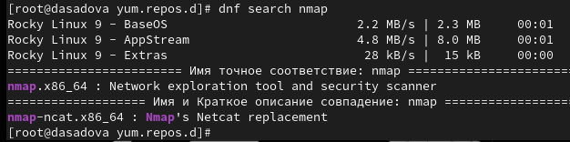

##

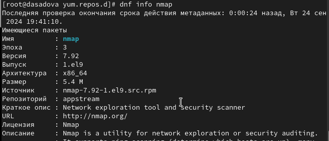

##

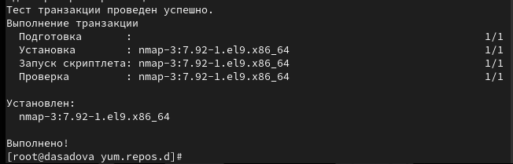

##

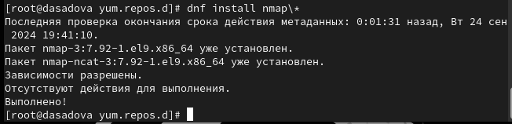

- Разница между dnf install nmap и dnf install nmap\* состоит в том, что первая команда загружает патеты только с именем nmap, а вторая с nmap и дополнительными символами относящимися к имени файла 

##

-  Удалите nmap:

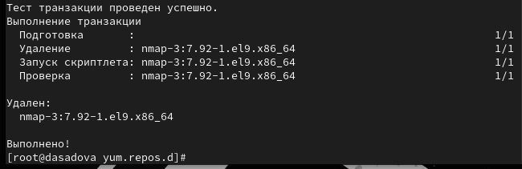

##

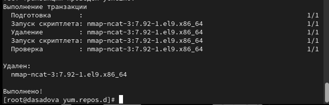

##

- Получите список имеющихся групп пакетов, затем установите группу пакетов RPM Development Tools:

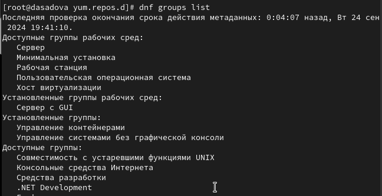

##

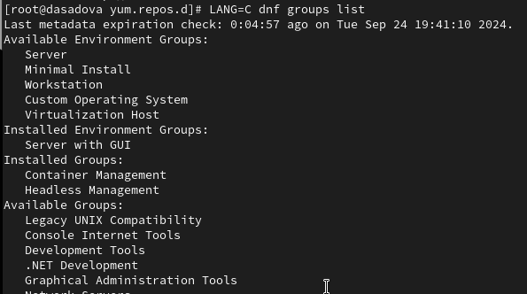

##

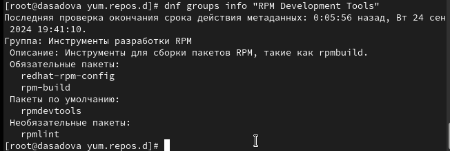

##

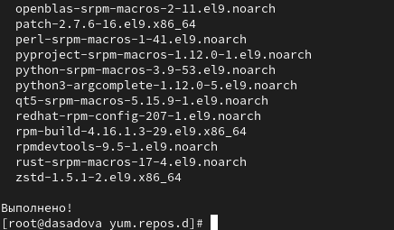

##

- Для удаления группы пакетов RPM Development Tools можно воспользоваться командой.

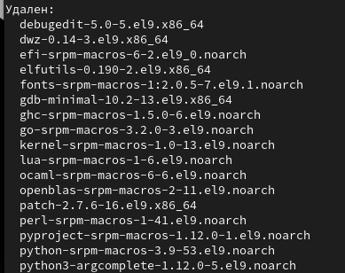

##

- Посмотрите историю использования команды dnf:

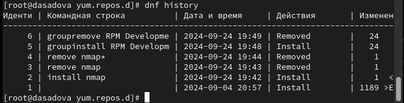

##

- и отмените последнее, например шестое по счёту, действие:

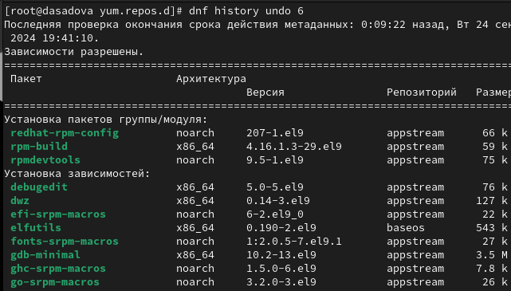

##

- Отменим последную команду и заново загрузим пакет RPM Development Tools

## Использование rpm

- Предположим, что требуется установить текстовый браузер lynx из rpm-пакета.

- Скачайте rpm-пакет lynx:

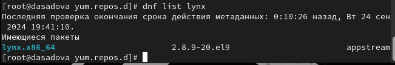

##

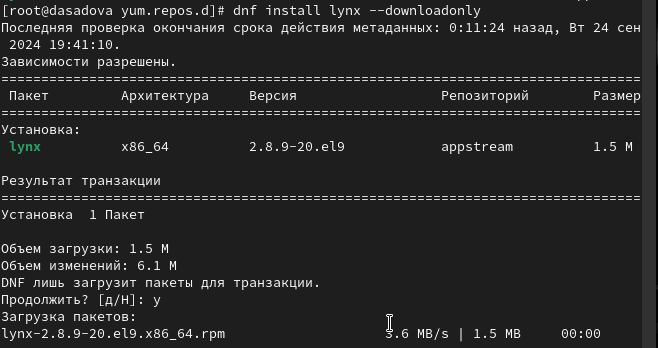

##

- Перейдите в этот каталог и затем установите rpm-пакет:

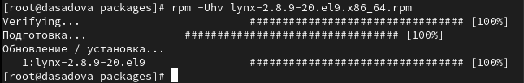

##

- Определите расположение исполняемого файла:

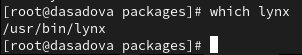

##

- Используя rpm, определите по имени файла, к какому пакету принадлежит lynx:

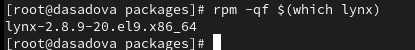

##

- и получите дополнительную информацию о содержимом пакета, введя:

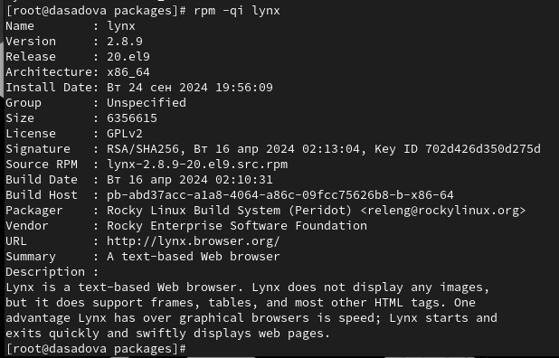

##

- Получите список всех файлов в пакете, используя:

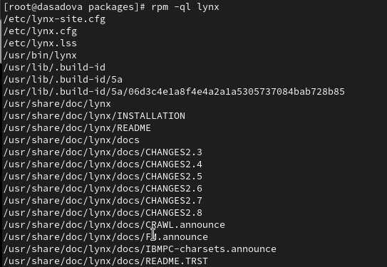

##

- а также выведите перечень файлов с документацией пакета, введя:

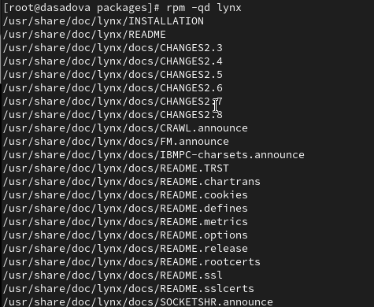

##

- Посмотрите файлы документации, применив команду man lynx.

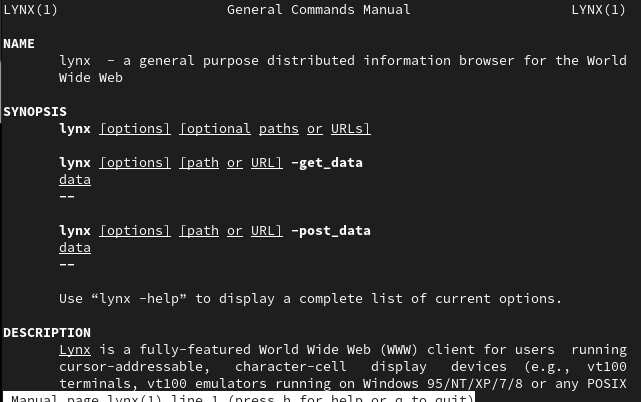

##

- Выведите на экран перечень и месторасположение конфигурационных файлов пакета:

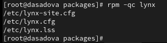

##

- Выведите на экран расположение и содержание скриптов, выполняемых при установке пакета:

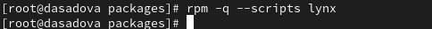

##

- В отдельном терминале под своей учётной записью запустите текстовый браузер lynx, чтобы проверить корректность установки пакета.

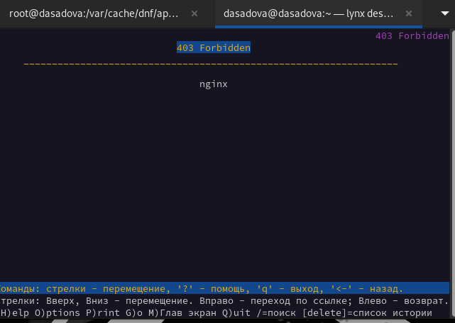

##

Я запустила этот покет с помощью команды lynx desired url

##

- Вернитесь в терминал с учётной записью root и удалите пакет:

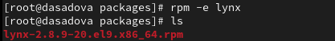

##

- Предположим, что требуется из rpm-пакетов установить dnsmasq (DNS-, DHCP- и TFTP-сервер)

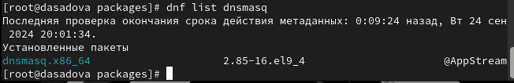

##

- Выведите на экран расположение и содержание скриптов, выполняемых при установке пакета:

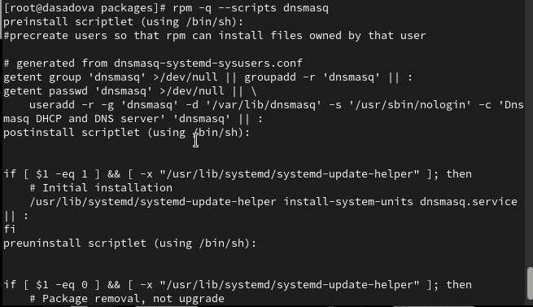

##

- Скрипты можно использовать для автоматизации повседневных действий в любой отрасли. Если речь о разработке — написанный под конкретные задачи сценарий может обрабатывать данные, рисовать график на основе входной информации, связываться с сервером, анимировать дизайн сайта или делать что-то еще.

##

- Вернитесь в терминал с учётной записью root и удалите пакет:

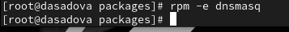

## Результаты

- Получили навыки работы с репозиториями и менеджерами пакетов.

