---
## Front matter
title: "Лабораторная работа № 4."
subtitle: "Работа с программными пакетами"
author: "Диана Алексеевна Садова"

## Generic otions
lang: ru-RU
toc-title: "Содержание"

## Bibliography
bibliography: bib/cite.bib
csl: pandoc/csl/gost-r-7-0-5-2008-numeric.csl

## Pdf output format
toc: true # Table of contents
toc-depth: 2
lof: true # List of figures
lot: true # List of tables
fontsize: 12pt
linestretch: 1.5
papersize: a4
documentclass: scrreprt
## I18n polyglossia
polyglossia-lang:
  name: russian
  options:
	- spelling=modern
	- babelshorthands=true
polyglossia-otherlangs:
  name: english
## I18n babel
babel-lang: russian
babel-otherlangs: english
## Fonts
mainfont: PT Serif
romanfont: PT Serif
sansfont: PT Sans
monofont: PT Mono
mainfontoptions: Ligatures=TeX
romanfontoptions: Ligatures=TeX
sansfontoptions: Ligatures=TeX,Scale=MatchLowercase
monofontoptions: Scale=MatchLowercase,Scale=0.9
## Biblatex
biblatex: true
biblio-style: "gost-numeric"
biblatexoptions:
  - parentracker=true
  - backend=biber
  - hyperref=auto
  - language=auto
  - autolang=other*
  - citestyle=gost-numeric
## Pandoc-crossref LaTeX customization
figureTitle: "Рис."
tableTitle: "Таблица"
listingTitle: "Листинг"
lofTitle: "Список иллюстраций"
lotTitle: "Список таблиц"
lolTitle: "Листинги"
## Misc options
indent: true
header-includes:
  - \usepackage{indentfirst}
  - \usepackage{float} # keep figures where there are in the text
  - \floatplacement{figure}{H} # keep figures where there are in the text
---

# Цель работы

Получить навыки работы с репозиториями и менеджерами пакетов.

# Последовательность выполнения работы

## Работа с репозиториями

1. В консоли перейдите в режим работы суперпользователя (используйте команду su -).(рис. [-@fig:001]).

{#fig:001 width=90%}

2. Перейдите в каталог /etc/yum.repos.d и изучите содержание каталога и файлов репозиториев:(рис. [-@fig:002]).

{#fig:002 width=90%}

3. Выведите на экран список репозиториев:(рис. [-@fig:003]).

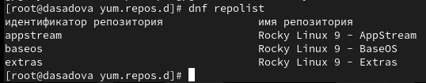{#fig:003 width=90%}

и поясните полученную информацию.

Данная команда отображает списк подключённых репозиториев

4. Выведите на экран список пакетов, в названии или описании которых есть слово user:(рис. [-@fig:004]).

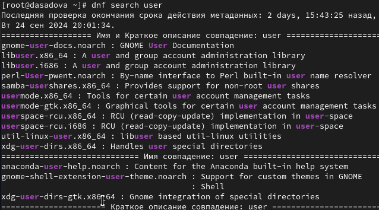{#fig:004 width=90%}

и поясните полученную информацию.

Данная команда ищет все пакеты с именем в котором есть слово user

5. Установите nmap, предварительно изучив информацию по имеющимся пакетам:(рис. [-@fig:005]),(рис. [-@fig:006]),(рис. [-@fig:007]),(рис. [-@fig:008]).

{#fig:005 width=90%}

{#fig:006 width=90%}

{#fig:007 width=90%}

{#fig:008 width=90%}

Поясните разницу между dnf install nmap и dnf install nmap\*.

Разница между dnf install nmap и dnf install nmap\* состоит в том, что первая команда загружает патеты только с именем nmap, а вторая с nmap и дополнительными символами относящимися к имени файла 

6. Удалите nmap:(рис. [-@fig:009]),(рис. [-@fig:010]).

{#fig:009 width=90%}

{#fig:010 width=90%}

7. Получите список имеющихся групп пакетов, затем установите группу пакетов RPM Development Tools:(рис. [-@fig:011]),(рис. [-@fig:012]),(рис. [-@fig:013]),(рис. [-@fig:014]).

{#fig:011 width=90%}

{#fig:012 width=90%}

{#fig:013 width=90%}

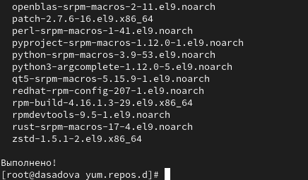{#fig:014 width=90%}

Для удаления группы пакетов RPM Development Tools можно воспользоваться командой(рис. [-@fig:015]).

{#fig:015 width=90%}

8. Посмотрите историю использования команды dnf:(рис. [-@fig:016]).

{#fig:016 width=90%}

и отмените последнее, например шестое по счёту, действие:(рис. [-@fig:017]).

{#fig:017 width=90%}

Отменим последную команду и заново загрузим пакет RPM Development Tools

## Использование rpm

Предположим, что требуется установить текстовый браузер lynx из rpm-пакета.

1. Скачайте rpm-пакет lynx:(рис. [-@fig:018]),(рис. [-@fig:019]).

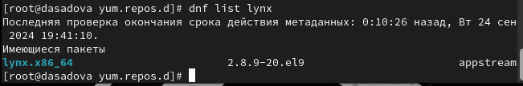{#fig:018 width=90%}

{#fig:019 width=90%}

2. Найдите каталог, в который был помещён пакет после загрузки:(рис. [-@fig:020]),(рис. [-@fig:021]).

{#fig:020 width=90%}

{#fig:021 width=90%}

3. Перейдите в этот каталог и затем установите rpm-пакет:(рис. [-@fig:022]).

{#fig:022 width=90%}

4. Определите расположение исполняемого файла:(рис. [-@fig:023]).

{#fig:023 width=90%}

5. Используя rpm, определите по имени файла, к какому пакету принадлежит lynx:(рис. [-@fig:024]).

{#fig:024 width=90%}

и получите дополнительную информацию о содержимом пакета, введя:(рис. [-@fig:025]).

{#fig:025 width=90%}

6. Получите список всех файлов в пакете, используя:(рис. [-@fig:026]).

{#fig:026 width=90%}

а также выведите перечень файлов с документацией пакета, введя:(рис. [-@fig:027]).

{#fig:027 width=90%}

Посмотрите файлы документации, применив команду man lynx.(рис. [-@fig:028]).

{#fig:028 width=90%}

7. Выведите на экран перечень и месторасположение конфигурационных файлов пакета:(рис. [-@fig:029]).

{#fig:029 width=90%}

8. Выведите на экран расположение и содержание скриптов, выполняемых при установке пакета:(рис. [-@fig:030]).

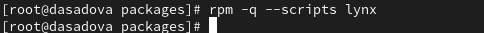{#fig:030 width=90%}

и поясните, для чего предназначены скрипты, если они есть.

У меня эти скрипты по какой-то причине не вывелись, так что я не могу объяснить их содержание 

9. В отдельном терминале под своей учётной записью запустите текстовый браузер lynx, чтобы проверить корректность установки пакета.(рис. [-@fig:031]).

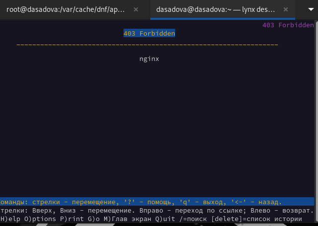{#fig:031 width=90%}

Я запустила этот покет с помощью команды lynx desired url

10. Вернитесь в терминал с учётной записью root и удалите пакет:(рис. [-@fig:032]).

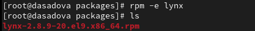{#fig:032 width=90%}

Предположим, что требуется из rpm-пакетов установить dnsmasq (DNS-, DHCP- и TFTP-сервер).(рис. [-@fig:033]).

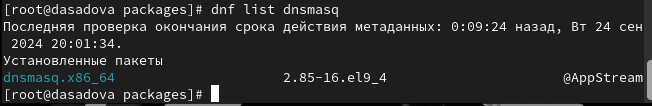{#fig:033 width=90%}

1. Установите пакет dnsmasq:(рис. [-@fig:034]).

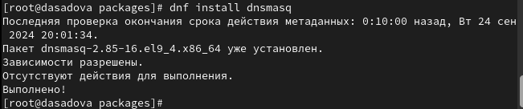{#fig:034 width=90%}

и определите расположение исполняемого файла:(рис. [-@fig:035]).

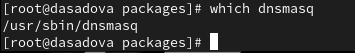{#fig:035 width=90%}

2. Определите по имени файла, к какому пакету принадлежит dnsmasq:(рис. [-@fig:036]).

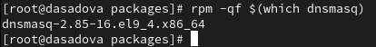{#fig:036 width=90%}

и получите дополнительную информацию о содержимом пакета:(рис. [-@fig:037]).

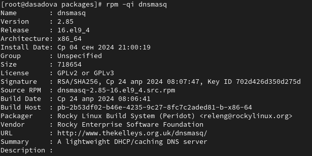{#fig:037 width=90%}

3. Получите список всех файлов в пакете:(рис. [-@fig:038]).

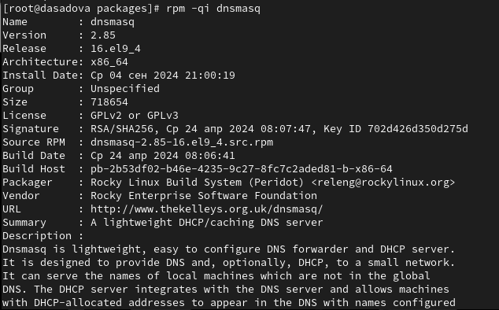{#fig:038 width=90%}

а также выведите перечень файлов с документацией пакета:(рис. [-@fig:039]).

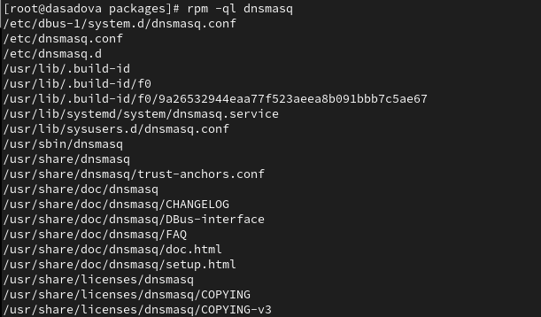{#fig:039 width=90%}

Посмотрите файлы документации, применив команду man dnsmasq.(рис. [-@fig:040]).

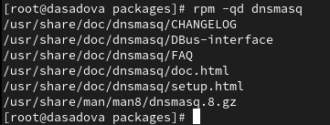{#fig:040 width=90%}

4. Выведите на экран перечень и месторасположение конфигурационных файлов пакета:(рис. [-@fig:041]).

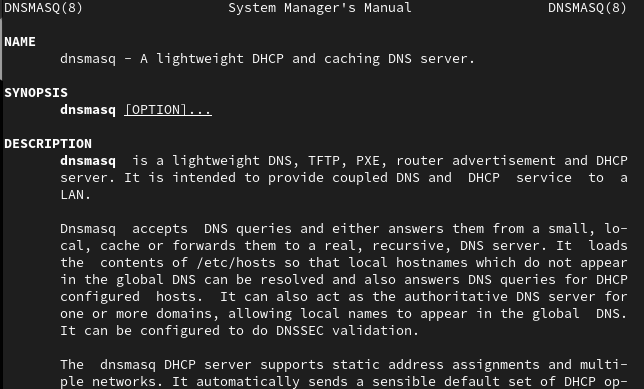{#fig:041 width=90%}

5. Выведите на экран расположение и содержание скриптов, выполняемых при установке пакета:(рис. [-@fig:042]).

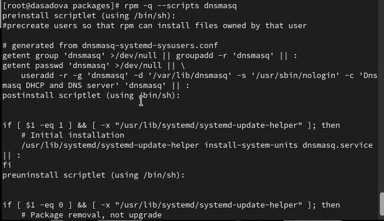{#fig:042 width=90%}

и поясните, для чего предназначены скрипты.

Скрипты можно использовать для автоматизации повседневных действий в любой отрасли. Если речь о разработке — написанный под конкретные задачи сценарий может обрабатывать данные, рисовать график на основе входной информации, связываться с сервером, анимировать дизайн сайта или делать что-то еще.

6. Вернитесь в терминал с учётной записью root и удалите пакет:(рис. [-@fig:043]).

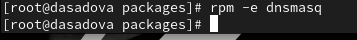{#fig:043 width=90%}

# Выводы

Получили навыки работы с репозиториями и менеджерами пакетов.

# Список литературы{.unnumbered}

::: {#refs}
:::
