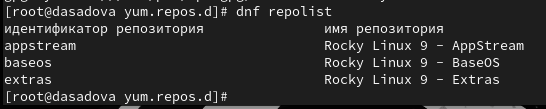

---
## Front matter
title: "Лабораторная работа № 1."
subtitle: "Установка и конфигурация операционной системы на виртуальную машину"
author: "Диана Алексеевна Садова"

## Generic otions
lang: ru-RU
toc-title: "Содержание"

## Bibliography
bibliography: bib/cite.bib
csl: pandoc/csl/gost-r-7-0-5-2008-numeric.csl

## Pdf output format
toc: true # Table of contents
toc-depth: 2
lof: true # List of figures
lot: true # List of tables
fontsize: 12pt
linestretch: 1.5
papersize: a4
documentclass: scrreprt
## I18n polyglossia
polyglossia-lang:
  name: russian
  options:
	- spelling=modern
	- babelshorthands=true
polyglossia-otherlangs:
  name: english
## I18n babel
babel-lang: russian
babel-otherlangs: english
## Fonts
mainfont: PT Serif
romanfont: PT Serif
sansfont: PT Sans
monofont: PT Mono
mainfontoptions: Ligatures=TeX
romanfontoptions: Ligatures=TeX
sansfontoptions: Ligatures=TeX,Scale=MatchLowercase
monofontoptions: Scale=MatchLowercase,Scale=0.9
## Biblatex
biblatex: true
biblio-style: "gost-numeric"
biblatexoptions:
  - parentracker=true
  - backend=biber
  - hyperref=auto
  - language=auto
  - autolang=other*
  - citestyle=gost-numeric
## Pandoc-crossref LaTeX customization
figureTitle: "Рис."
tableTitle: "Таблица"
listingTitle: "Листинг"
lofTitle: "Список иллюстраций"
lotTitle: "Список таблиц"
lolTitle: "Листинги"
## Misc options
indent: true
header-includes:
  - \usepackage{indentfirst}
  - \usepackage{float} # keep figures where there are in the text
  - \floatplacement{figure}{H} # keep figures where there are in the text
---

# Цель работы

Целью данной работы является приобретение практических навыков установки операционной системы на виртуальную машину, настройки минимально необходимых для дальнейшей работы сервисов

# Последовательность выполнения работы

Если вы работаете не в дисплейном классе, а на собственной технике, то расположение каталога виртуальных машин определяете по своему усмотрению, а DVD-образ операционной системы, соответствующий архитектуре вашего компьютера, предварительно скачиваете с сайта разработчика https://rockylinux.org/download.

Создайте новую виртуальную машину: в VirtualBox выберите Машина Создать. Укажите имя виртуальной машины (в названии должен присутствовать ваш логин в дисплейном классе), тип операционной системы — Linux, версию операционной системы —RedHat (64-bit). Укажите путь к iso-образу устанавливаемого дистрибутива, отметьте «Пропустить автоматическую установку» (рис. [-@fig:001]).

{#fig:001 width=90%}

Укажите размер основной памяти виртуальной машины — 2048 МБ (или большее число, кратное 1024 МБ, если позволяют технические характеристики вашего компьютера) и число процессоров, например 1 или 2.(рис. [-@fig:002]).

{#fig:002 width=90%}

Для своего удобства я устанавила память виртуальной машины 4096 МБ и число процессоров - 4.

Задайте размер виртуального жёсткого диска — 40ГБ (рис. [-@fig:003]).

{#fig:003 width=90%}

Так же, для своего удобства установила жёсткий диск на 100 ГБ.

Запустите виртуальную машину и в окне с меню переключитесь на строку «Install Rocky Linux версия», нажмите Enter для запуска установки образа ОС.(рис. [-@fig:004]).

{#fig:004 width=90%}

В окне «Добро пожаловать в Rocky Linux...» выберите English в качестве языка интерфейса и перейдите к настройкам установки операционной системы. (рис. [-@fig:005]).

{#fig:005 width=90%}

При необходимости скорректируйте часовой пояс, раскладку клавиатуры (рекомендуется добавить русский язык, но в качестве языка по умолчанию указать английский язык; задать комбинацию клавиш для переключения между раскладками клавиатуры —например Alt + Shift ), задайте в дополнение к английскому языку поддержку русского языка в ОС. (рис. [-@fig:006]).

{#fig:006 width=90%}

Отключите KDUMP (рис. [-@fig:007]).

{#fig:007 width=90%}

Место установки ОС оставьте без изменения (рис. [-@fig:008]).

{#fig:008 width=90%}

Включите сетевое соединение и в качестве имени узла укажите user.localdomain, где вместо user укажите имя своего пользователя в соответствии с соглашением об именовании. (рис. [-@fig:009]).

{#fig:009 width=90%}

Установите пароль для root, разрешение на ввод пароля для root при использовании SSH (рис. [-@fig:010]).

{#fig:010 width=90%}

Затем задайте локального пользователя с правами администратора и пароль для него. Если в окне установки раздел для работы с локальным пользователем визуально не виден, то используйте последовательно клавиши Tab и Enter для перемещения к этим настройкам после раздела задания пароля для пользователя root.(рис. [-@fig:011]).

{#fig:011 width=90%}

После задания необходимых настроек нажмите на Begin Installation для начала установки образа системы (рис. [-@fig:012]).

{#fig:012 width=90%}

После завершения установки операционной системы корректно перезапустите виртуальную машину (рис. [-@fig:013]).

{#fig:013 width=90%}

Войдите в ОС под заданной вами при установке учётной записью. В меню Устройства виртуальной машины подключите образ диска дополнений гостевой ОС, при необходимости введите пароль пользователя root вашей виртуальной ОС.(рис. [-@fig:014]),(рис. [-@fig:015]).

{#fig:014 width=90%}

{#fig:015 width=90%}

После загрузки дополнений нажмите Return или Enter и корректно перезагрузите виртуальную машину.(рис. [-@fig:017]).

{#fig:017 width=90%}

Если по каким-то причинам образ диска дополнений гостевой ОС не устанавливается через графическое меню, можно воспользоваться консольными командами. Войдите в ОС под заданной вами при установке учётной записью пользователя, получите полномочия администратора, перейдите в каталог /run/media/имя_пользователя/VBox_GAs_версия/, затем запустите VBoxLinuxAdditions.run: (рис. [-@fig:018]),(рис. [-@fig:019]),(рис. [-@fig:020]).

{#fig:018 width=90%}

{#fig:019 width=90%}

{#fig:020 width=90%}

После загрузки дополнений корректно перезагрузите операционную систему на виртуальной машине.

## Установка имени пользователя и названия хоста

Если при установке виртуальной машины вы задали имя пользователя или имя хоста, не удовлетворяющее соглашению об именовании (см. раздел 1.2.2), то вам необходимо исправить это.

1. Запустите виртуальную машину и залогиньтесь.(рис. [-@fig:021]).

{#fig:021 width=90%}

2. Запустите терминал и получите полномочия администратора:(рис. [-@fig:022])

3. Создайте пользователя (вместо username укажите ваш логин в дисплейном классе):(рис. [-@fig:022]).

{#fig:022 width=90%}

4. Задайте пароль для пользователя (вместо username укажите ваш логин в дисплейном классе):(рис. [-@fig:023]).

{#fig:023 width=90%}

5. Установите имя хоста (вместо username укажите ваш логин в дисплейном классе): (рис. [-@fig:024]).

{#fig:024 width=90%}

6. Проверьте, что имя хоста установлено верно:(рис. [-@fig:025]).

{#fig:025 width=90%}

# Домашнее задание
Дождитесь загрузки графического окружения и откройте терминал. В окне терминала проанализируйте последовательность загрузки системы, выполнив команду dmesg. 

Можно просто просмотреть вывод этой команды:(рис. [-@fig:026]).

dmesg | less

{#fig:026 width=90%}

Можно использовать поиск с помощью grep:

dmesg | grep -i "то, что ищем"

Получите следующую информацию.

1. Версия ядра Linux (Linux version).(рис. [-@fig:027]).

{#fig:027 width=90%}

2. Частота процессора (Detected Mhz processor).(рис. [-@fig:028]).

{#fig:028 width=90%}

3. Модель процессора (CPU0).(рис. [-@fig:029]).

{#fig:029 width=90%}

4. Объем доступной оперативной памяти (Memory available).(рис. [-@fig:030]).

{#fig:030 width=90%}

5. Тип обнаруженного гипервизора (Hypervisor detected).(рис. [-@fig:031]).

{#fig:031 width=90%}

6. Тип файловой системы корневого раздела.(рис. [-@fig:032]).

{#fig:032 width=90%}

7. Последовательность монтирования файловых систем.(рис. [-@fig:033]).

{#fig:033 width=90%}

# Выводы

Мы приобрели практические навыки установки операционной системы на виртуальную машину, настройки минимально необходимых для дальнейшей работы сервисов. А так же научились переименовывать хостинг и изменять пароль для входа в систему.

# Список литературы{.unnumbered}

::: {#refs}
:::
